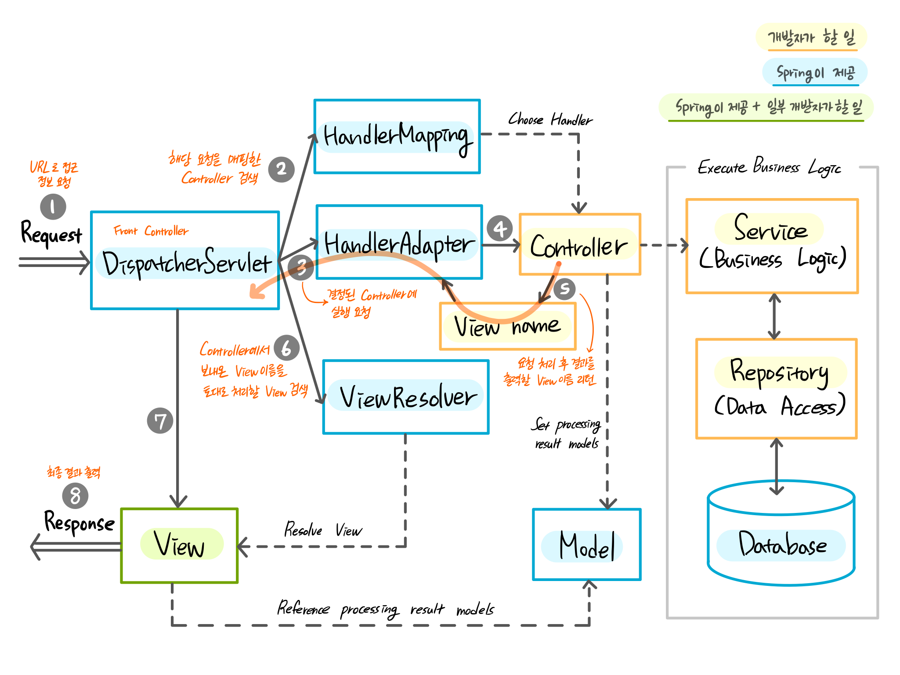
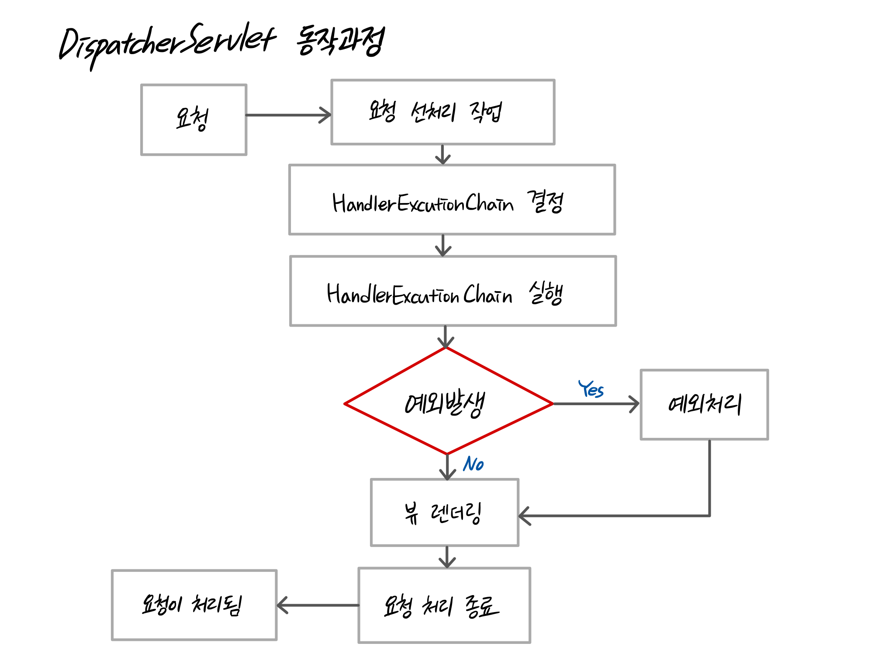

# 웹 프로그래밍 - 3. 웹 앱 개발:예약서비스 1/4

## 9. Spring MVC - BE

### MVC(Model-View-Controller)
- Model : 뷰가 렌더링하는데 필요한 데이터
- View : 실제로 보여지는 부분
- Controller : 사용자의 액션에 응답하는 컴포넌트

+ MVC Model1 아키텍쳐 : JSP가 요청, 응답을 모두 수행
+ MVC Model2 아키텍쳐 : Servlet(Controller)가 요청받고, JSP(View)를 통해 응답
+ MVC Model2 발전형 : 프론트 컨트롤러에서 요청을 받아 컨트롤러 클래스(또는 핸들러 클래스)에서 요청처리
+ MVC Model2 발전을 Spring Web 모듈에 구현해 놓은 것이 Spring MVC

### Spring MVC 기본 동작 흐름

+ DispatcherServlet
   - Front Controller
   - 공통작업 처리 후 적절한 세부 컨트롤러로 작업 위임
   - 이론적으로 여러 개 사용 가능하지만 일반적으로 1개만 사용
+ HandlerMapping : 요청처리를 담당할 컨트롤러를 매핑
+ HandlerAdapter : 적합한 파라미터를 추출해 컨트롤러의 메서드 호출
+ MultipartResolver : 파일처리를 위한 멀티파트 요청을 파싱
+ LocaleResolver : Header, URL 파라미터, 쿠키등을 이용하여 지역정보 결정
+ ThemeResolver : 특정 요청에 사용할 테마를 찾아 요청의 테마 대체
+ HandlerExceptionResolver : 예외 발생 처리(예. 에러페이지 출력, 로그 출력)
+ RequestToViewNameTranslator : 컨트롤러에서 뷰 이름을 제공하지 않은 경우 URL같은 요청정보를 참고하여 자동으로 뷰 이름을 생성
+ ViewResolver : 컨트롤러가 리턴한 뷰 이름을 이용하여 뷰 오브젝트를 찾음
+ FlashMapManager : FlashMap인스턴스를 저장, 획득, 관리

### DispatcherServlet 수행과정


#### 선처리작업
1. Locale 결정
   - Spring 지역화(예. 같은 페이지를 누군가는 한국어로 보고 누군가는 영어로 본다)
   - org.springframework.web.servlet.LocaleResolver
2. 결정된 Locale을 RequestContextHolder에 저장
   - 프레임워크의 코드가 단계마다 요청 정보를 넘겨받지 않고 요청 정보를 얻기 위함
   - org.springframework.web.context.request.RequestContextHolder
3. FlashMap복원
   - Spring 3에서 추가됨
   - redirect로 값 전달 시 한 번 값을 유지하고 조회시 삭제됨
   - org.springframework.web.servlet.FlashMapManager
4. 멀티파트 요청인지 확인 후 맞다면 MultipartResolver가 해당 요청을 MultipartHttpServletRequest로 감싼다
   - org.springframework.web.MultipartResolver
5. HandlerExecutionChain 결정 단계로 넘어감

#### HandlerExecutionChain 결정
1. HandlerMapping으로 HandlerExecutionChain 결정
   - 어떤 핸들러가 요청을 처리할 지 결정
   - org.springframework.web.servlet.HandlerMapping
   - 디폴트: BeanNameHandlerMapping, DefaultAnnotationHandlerMapping
2. HandlerExecutionChain을 찾지 못하면 Http 404를 클라이언트에게 전달하고 요청처리 종료
3. HandlerExecutionChain을 찾았다면 HandlerAdapter를 찾고 결정
   - org.springframework.web.servlet.HandlerExecutionChain
      + 실제 호출된 핸들에 대한 참조를 가짐
      + 핸들러 실행 전 후 수행될 HandlerInterceptor 참조
4. HandlerAdapter를 찾지 못하면 ServletException발생 후 요청 처리 종료
5. HandlerAdapter를 찾았다면 HandlerExecutionChain 실행 단계로 넘어감
   - org.springframework.web.servlet.HandlerAdapter

#### HandlerExecutionChain 실행
1. HandlerInterceptor의 preHandle을 호출해 요청 처리하고 계속 요청을 처리할지 결정
2. 요청처리를 계속 한다면 HandlerAdapter를 통해 핸들러 실행
3. 리턴된 ModelAndView가 없을 경우 5번으로 이동
4. 리턴된 ModelAndView가 있을 경우 해당 ModelAndView가 View를 갖지 않는다면 RequestToViewNameTranslator가 요청을 참조하여 뷰 이름 결정
   - org.springframework.web.servlet.ModelAndView
      + Controller의 처리 결과를 보여줄 View와 View에서 사용할 값 전달
   - org.springframework.web.servlet.RequestToViewNameTranslator
5. 인터셉터의 postHandle을 호출해 요청 처리
6. 예외가 있다면 예외처리 단계로, 없다면 뷰 렌더링 단계로 넘어감

#### 예외처리
1. HandlerExceptionResolver에 예외 문의
   - org.springframework.web.servlet.HandlerExceptionResolver
      + 예외가 던져졌을 때 어떤 핸들러를 실행할 지 알려줌
2. ModelAndView를 리턴하지 못하면 예외를 다시 던짐
3. ModelAndView를 리턴한다면 요청처리 재개

#### 뷰 렌더링
1. 뷰가 String을 참조하는지 검사
2. String을 참조한다면 ViewResolver로 View구현체를 찾음
   - org.springframework.web.servlet.ViewResolver
      + 컨트롤러가 리턴한 뷰 이름을 참조하여 적절한 뷰 오브젝트를 찾아줌
      + 뷰의 종류에 따라 적절한 ViewResolver를 추가 설정할 수 있음
3. View구현체가 존재하는지 검사
4. View구현체가 존재하지 않는다면 ServletException발생
5. View구현체가 존재한다면 View구현체로 렌더링
6. 요청 처리 종료 단계로 넘어감

#### 요청처리 종료
1. HandlerExecutionChain이 존재하는지 검사하여 존재하지 않는다면 3번으로 이동
2. HandlerExecutionChain이 존재한다면 인터셉터의 afterCompletion 메소드 실행
3. RequestHandlerEvent 발생하여 요청이 처리됨
   - org.springframework.web.context.support.RequestHandlerEvent
      + org.springframework.web.context.ApplicationListener를 구현해 이를 빈으로 등록하면 이 이벤트를 받을 수 있고 로깅도 할 수 있음

---

### 실습
입력받은 두 값의 합을 반환하는 어플리케이션 만들기

#### 프로젝트 생성하기
   1. Maven Project(maven-archetype-webapp) 생성
   2. Navigator에서 src > main 아래에 java폴더 생성
   3. pom.xml의 <plugins>에 jdk1.8 설정, <dependencies>에 사용할 라이브러리 추가
   4. Update Project
   5. .settings > org.eclipes.wst.common.project.facet.core.xml에서 jst.web의 버전을 3.1로 변경
   6. 이클립스 재실행 후 Propertis > Project Facets에서 Dynamic Web Module이 3.1인지 확인

#### DispatcherServlet을 Front Controller로 설정하기
   - web.xml에 설정
   - (Servlet3.0 이상) javax.servlet.ServletContainerInitializer 이용
   - org.springframework.web.WebApplicationInitializer 인터페이스를 구현해 사용
      + 단점 : 처음 웹 어플리케이션 구동시간이 오래 걸릴 수 있음
      + <url-pattern>이 '/'이기 때문에 모든 요청을 받게 됨

#### Spring MVC 설정하기
   kr.or.connect.webmvc.config.WebMvcContextConfiguration
   - @Configuration
      + 자바config파일임을 알림
   - @EnableWebMvc
      + 웹에 필요한 빈을 대부분 자동으로 설정해줌
      + 기본설정 이외의 설정이 필요한 경우 해당 클래스를 상속(WebMvcConfigurerAdapter)받아 메소드를 오버라이딩하여 구현
      + xml로 설정 시 <mvc:annotation-driven />과 동일
   - @ComponentScan(basePackages = { "kr.or.connect.mvcexam.controller" })
      + Controller, Service, Repository, Content 애노테이션이 붙은 클래스를 찾아 스프링 컨테이너가 관리하도록 함
      + basePackages를 반드시 지정할 것

#### Controller 작성하기
   - @Controller 애노테이션을 클래스위에 붙임
   - @RequesrMapping
      + Http요청과 이를 다루기 위한 Controller의 메소드를 연결하는 애노테이션
      ```java
      // Http Method와 연결
      @RequestMapping(value="/users", method=RequestMethod.POST)
      // Spring 4.3부터 아래 애노테이션 사용 가능
      @GetMapping, @PostMapping, @PutMapping, @DeleteMapping, @PatchMapping

      // Http 특정 헤더와 연결
      @RequestMapping(method = RequestMethod.GET, headers = "content-type=application/json")

      // Http Parameter와 연결
      @RequestMapping(method = RequestMethod.GET, params = "type=raw")

      // Content-Type Header와 연결
      @RequestMapping(method = RequestMethod.GET, consumes = "application/json")

      // Accept Header와 연결
      @RequestMapping(method = RequestMethod.GET, produces = "application/json")
      ```


<br>


---
[HOME](https://github.com/tunaep5/Boostcourse/blob/master/README.md)
